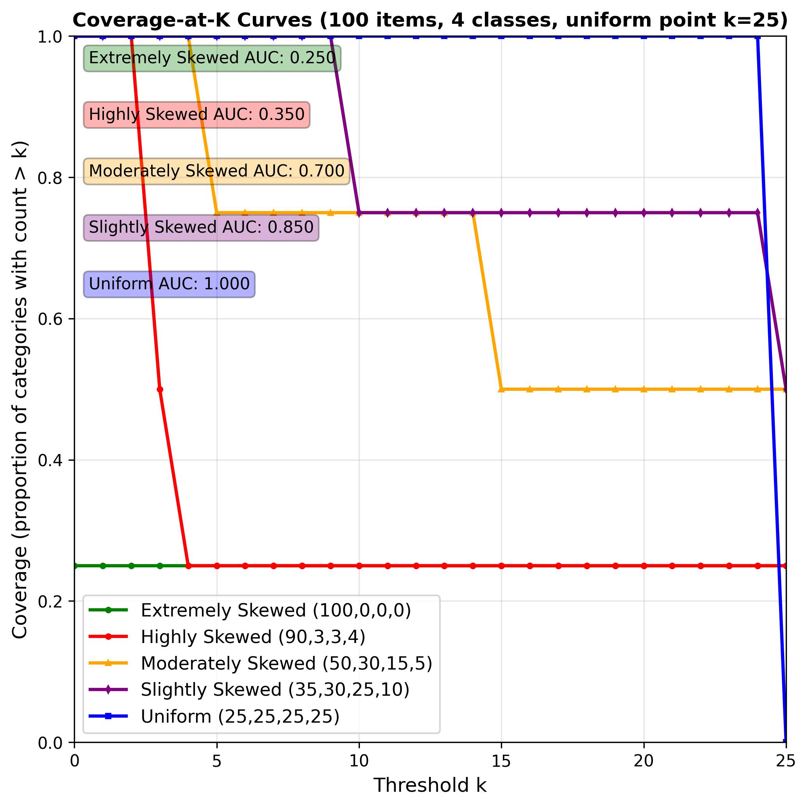

# Coverage-at-K and its AUC: A Simple Evenness Metrics

A simple and intuitive metric for measuring the evenness of frequency distributions, focusing on scarce classes. 

## Motivation

Traditional evenness metrics like Shannon entropy can be abstract. Sometimes, what matters is if we have enough items for each category. The most similar metric is "Coverage", which computes the proportion of categories that has more than 0 items. While useful, coverage is limited because "0" is a pretty extreme number, ending up treating any 1+ counts equal. 

As an extension of Coverage, we propose two metrics -- Coverage-at-K (C@K) and AUC-C@K.

- **Coverage-at-K**: What’s the proportion of categories that has more than K items? 

Multiple C@K values can be aggregated into a single number using the area under curve.

- **AUC-C@K**: How quickly does C@K decrease as we raise the bar, K? 

A uniform distribution will have a broad, flat curve, while a skewed distribution will have a curve that drops off very quickly. We can quantify this shape by measuring the area under the curve.

## Coverage-at-K: Details

Coverage-at-K (C@K) is the fraction of categories that have **more than** K items. This makes C@0 equal to standard coverage (non-empty proportion). In many cases, higher is better, though it may be the opposite depending on the application.

- K = 0: reduces to standard coverage (non-empty categories / total possible)
- As K increases, C@K decreases, showing how many categories are sufficiently populated
- Example (100 items, 4 classes): If item count is {A: 10, B: 15, C: 35, D:50}:
  - C@0 (Coverage) = 1.0
  - C@1, C@2, .. , C@9 = 1.0
  - C@10 = 0.75
  - C@14 = 0.75
  - C@15 = 0.5
  - C@35 = 0.25
  - C@49 = 0.25
  - C@50 = 0.0

## AUC-C@K: Details

The method involves analyzing a coverage curve up to a specific cutoff point called "Even Point" to aggregate the coverages at multiple K values.

### 1. The Coverage Curve

As shown in the example above, we can compute C@K with varying K from 0, and it will decrease eventually to 0.

### 2. Define the Even Point

Although we can increase K to the number of total items (e.g., 100 if there are 100 total items), we introduce a cutoff point for more meaningful analysis. This is called as the **"Even Point"**, which is the ideal count each observed (non-empty) category would have if the items were distributed evenly among them.

- **Even Point** = floor(total_items / number_of_observed_categories)

This Even Point serves as the upper limit for our analysis. We will measure the area under the coverage curve from k=0 up to this point. 

Even Point is designed so that AUC-C@K is normalized between [0, 1] where a uniform distribution will have a value of 1. However, AUC-C@K will never be 0, as an extremely skewed distribution will still have a non-zero C@K for K $\in [0, even\_point]$. 

### 3. Calculate the AUC Score

We now turn the coverage curve into a single, comparable number.

- Observed area: Sum C@K from k = 0 up to the Even Point (inclusive).
- Ideal area (perfectly uniform): Even Point × 1.0, because a uniform distribution keeps C@K = 1 up to the Even Point.
- `AUC-C@K = Observed area / Ideal area` ∈ [0, 1].


Interpretation: 1.0 means perfectly uniform; lower values indicate increasing skewness. If the distribution is a point-mass (Dirac delta) on a single class, it *converges* to 0 as the number of classes increases. Finally, in the case of distributions with high counts beyond Even Point, the skewness would be already reflected in their coverage behavior before the Even Point. 

Stopping at the Even Point ensures apples-to-apples comparisons; any extra mass beyond it is already reflected by how quickly C@K falls before that point.


## Example

```python
from collections import Counter
from metrics import auc_coverage

# Different types of distributions (100 items, 4 categories)
uniform = Counter({'a': 25, 'b': 25, 'c': 25, 'd': 25})
print(f"Uniform coverage: {auc_coverage(uniform, 4):.3f}")        # 1.000

slightly_skewed = Counter({'a': 35, 'b': 30, 'c': 25, 'd': 10})
print(f"Slightly skewed: {auc_coverage(slightly_skewed, 4):.3f}") # 0.750

moderately_skewed = Counter({'a': 50, 'b': 30, 'c': 15, 'd': 5})
print(f"Moderately skewed: {auc_coverage(moderately_skewed, 4):.3f}") # 0.500

highly_skewed = Counter({'a': 90, 'b': 3, 'c': 3, 'd': 4})
print(f"Highly skewed: {auc_coverage(highly_skewed, 4):.3f}")     # 0.250
```

## Visualization



The plot shows coverage curves for different distribution types. The uniform distribution maintains 100% coverage until k=25, while skewed distributions drop off at different rates based on their evenness.

## Usage

```bash
python example.py
```

This generates both numerical results and the visualization above. See `metric.py` for the code to compute C@K and AUC-C@K.

## Citation

If you use this concept or code in your research, please cite:

```bibtex
@misc{choi2025coverageatk,
  author       = {Choi, Keunwoo},
  title        = {{Coverage-at-K and its AUC: A Simple Evenness Metrics}},
  howpublished = {\url{https://github.com/keunwoochoi/coverage-at-k}},
  year         = {2025}
}
```