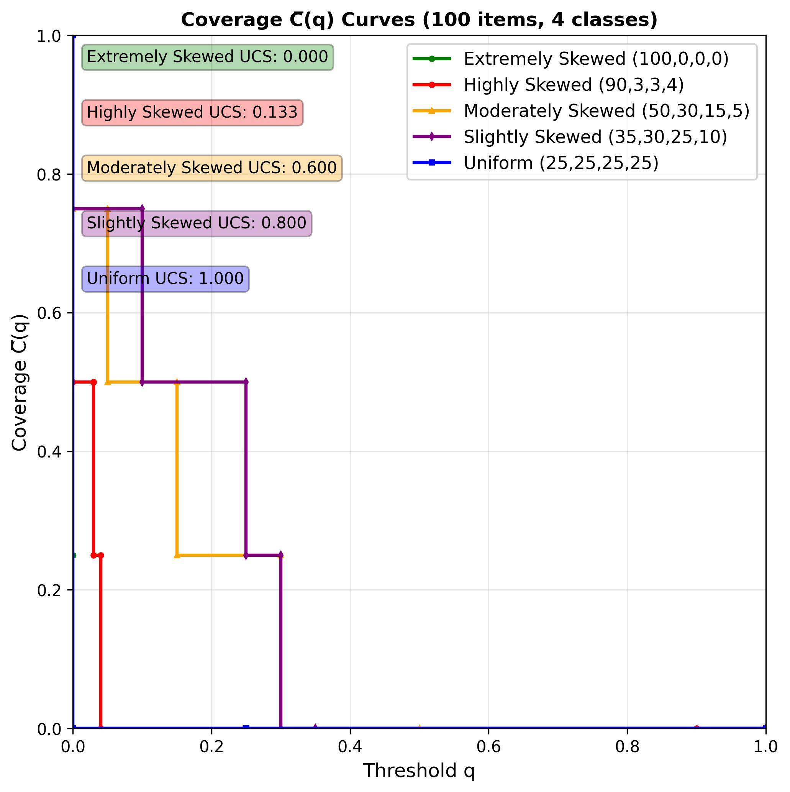

# Coverage-at-K / Coverage-at-Q: Simple Sharpness Metrics

Keunwoo Choi & Kyunghyun Cho (Sep 2025)

Two lightweight, interpretable metrics for describing how "spread out" (vs. sharp / concentrated) a categorical distribution or histogram is:

1. Coverage-at-K (C(K)) on counts with threshold K, and a normalized area metric AUC-C(K).
2. Coverage-at-Q (C̅(q)) on probabilities with threshold q, and a Uniform Divergence Score (UDS).

Both relax the binary notion of "covered vs. not" by varying a threshold and aggregating the resulting step curve.

## Quick Start

```python
from collections import Counter
from metrics import coverage_at_k, auc_catk, coverage_at_q, deviation_from_uniform

counts = Counter({'a': 50, 'b': 30, 'c': 15, 'd': 5})  # 100 items, 4 possible categories
total_possible = 4

print("C(0):", coverage_at_k(counts, 0, total_possible))          # non-empty proportion
print("AUC-C(K):", auc_catk(counts, total_possible))              # normalized evenness up to even point

probs = {k: v / sum(counts.values()) for k, v in counts.items()}
print("C̅(0) (probabilities):", coverage_at_q(probs, 0.0))         # always 1.0 if no zero-prob categories
print("DfU:", deviation_from_uniform(probs))                     # deviation from uniform step
```

Plots (generated by the example scripts):

<p align="center">
  
  
</p>

## 1. Motivation

Entropy is standard but often unintuitive to non-specialists. Plain coverage (fraction of non‑empty categories) is easy but brittle: a single noisy occurrence inflates it. We instead look at how coverage decays as the minimum acceptable count (K) or probability (Q) increases.

## 2. Coverage-at-K (C(K))

Given a count vector over a universe of `total_possible` categories (some may be absent), define

```
C(K) = (# categories with count > K) / total_possible.
```

Notes:
* Strict inequality (> K) makes C(0) equal to ordinary coverage (non‑empty proportion).
* C(K) is non‑increasing in K and eventually reaches 0.

Example (counts: A=10, B=15, C=35, D=50; total_possible=4):
* C(0) … C(9) = 1.00
* C(10) … C(14) = 0.75
* C(15) … C(34) = 0.50
* C(35) … C(49) = 0.25
* C(50+) = 0.00

### 2.1 Even Point and AUC-C(K)

Let:
* `total_items = sum(counts)`
* `observed_categories = number of categories with count > 0`
* `even_point = floor(total_items / observed_categories)`

This is the per-category count each observed category would have under perfect evenness. We integrate (sum) C(K) for K = 0 … even_point - 1 (i.e. `even_point` terms). To normalize, we compare against the "ideal" uniform plateau height: `(observed_categories / total_possible)`.

```
observed_area = sum_{K=0}^{even_point-1} C(K)
ideal_area    = even_point * (observed_categories / total_possible)
AUC-C(K)      = observed_area / ideal_area   ∈ [0,1].
```

Interpretation:
* 1.0 ⇒ all observed categories are as even as possible (uniform among those present AND all possible categories appear).
* ↓ toward 0 ⇒ mass is concentrated in fewer categories relative to ideal evenness.

## 3. Coverage-at-Q (C̅(q))

For a probability vector `p` over C categories (∑ p_c = 1), define

```
C̅(q) = (# categories with p_c ≥ q) / C.
```

This produces a non‑increasing step function from q=0 (value 1) to q>max p_c (value 0).

Uniform distribution (all p_c = 1/C):
* C̅(q) = 1 for 0 ≤ q ≤ 1/C
* C̅(q) = 0 for q > 1/C

## 4. Uniform Divergence Score (UDS)

We measure how far C̅(q) deviates from the uniform step. Let `q* = 1/C`. Define:

```
UDS(p) = C * [ ∫_{0}^{q*} (1 - C̅(q)(p)) dq  +  ∫_{q*}^{1} C̅(q)(p) dq ].
```

Because C̅(q)(p) and the uniform reference are proportions (already divided by C), UDS ∈ [0,1]:
* 0 for the uniform distribution.
* 1 for the maximally sharp (Dirac) distribution.

Implementation detail: we exploit the breakpoints at the sorted probabilities; the integral becomes a sum over intervals.

## 5. Functions Provided (`metrics.py`)

* `coverage_at_k(counts, k, total_possible)` → C(K)
* `auc_catk(counts, total_possible)` → normalized AUC-C(K)
* `coverage_at_q(probs, q)` → C̅(q) (≥ threshold)
* `deviation_from_uniform(probs)` / `uniform_divergence_score(probs)` → UDS

All inputs are lightweight Python primitives (`Counter`, `dict`).

## 6. Examples

### 6.1 Coverage-at-K / AUC-C(K)

See `example_ck.py` (also generates `coverage_at_k.jpg`).

Minimal excerpt:

```python
from collections import Counter
from metrics import coverage_at_k, auc_catk

counts_skewed = Counter({'a': 90, 'b': 3, 'c': 3, 'd': 4})
total_possible = 4
print(auc_catk(counts_skewed, total_possible))  # 0.350
```

### 6.2 Coverage-at-Q / UDS (C̅)

See `example_cq.py` (also generates `coverage_at_q.jpg`).

Notation: we use C(K) for count-threshold coverage and C̅(q) for probability-threshold coverage to avoid ambiguity.

Minimal excerpt:

```python
from collections import Counter
from metrics import coverage_at_q, uniform_divergence_score

counts = Counter({'a': 50, 'b': 30, 'c': 15, 'd': 5})
total = sum(counts.values())
probs = {k: v / total for k, v in counts.items()}
print(uniform_divergence_score(probs))  # 0.600  (UDS)
```

Both scripts print metric values for four qualitative regimes: uniform, slightly, moderately, and highly skewed.

## 7. Interpreting the Metrics

| Distribution (100 items, 4 cats) | C(0) | AUC-C(K) | UDS  |
|----------------------------------|------|----------|------|
| Uniform (25,25,25,25)            | 1.0  | 1.000    | 0.000|
| Slightly skewed (35,30,25,10)    | 1.0  | 0.850    | 0.300|
| Moderately skewed (50,30,15,5)   | 1.0  | 0.700    | 0.600|
| Highly skewed (90,3,3,4)         | 1.0  | 0.350    | 0.880|

Heuristics:
* AUC-C(K) decreases smoothly with concentration; UDS increases.
* C(0) alone cannot distinguish the four examples (all 1.0) — motivating these richer summaries.

Complementarity:
* AUC-C(K) depends on raw counts and the set of *possible* categories.
* UDS (via C̅(q)) depends only on normalized probabilities (ignores total mass and unseen possible categories).

## 8. Usage

```
python example_ck.py  # Coverage-at-K & AUC-C(K)
python example_cq.py  # Coverage-at-Q & UDS
```

Outputs include printed metric values and saved plots in the repository root.

## 9. Limitations & Notes

* C(K) uses a strict > K; changing to ≥ would shift plateau lengths.
* AUC-C(K) normalization assumes interest in evenness among all possible categories; if `total_possible` is unknown, you could substitute `len(counts)`.
* UDS is sensitive only to ordering and magnitudes of probabilities, not to sample size.
* Very small sample sizes can make counts-based AUC-C(K) unstable; consider smoothing or minimum count filters.
* Neither metric replaces entropy; they are alternative, more interpretable lenses.

## 10. For more information

Please refer to this technical report ["Coverage-at-K/Q: Simple and Interpretable Sharpness Metrics"](coverage_at_k_q.pdf) for more rigorous definitions as well as mathematical properties of these metrics.

## 11. Citation

If you use this code or the metric definitions, please cite:

```bibtex
@misc{choi2025coverageatk,
  author       = {Choi, Keunwoo and Cho, Kyunghyun},
  title        = {Coverage-at-K / Coverage-at-Q: Simple Metrics for Measuring Sharpness},
  howpublished = {\url{https://github.com/keunwoochoi/coverage-at-k}},
  year         = {2025}
}
```